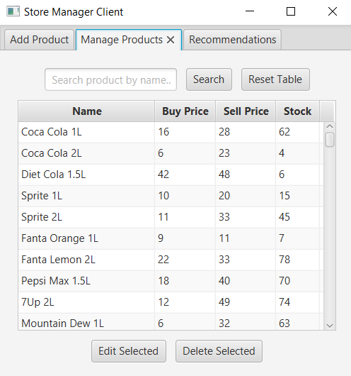
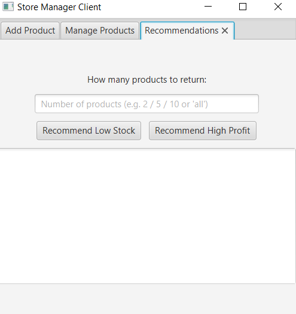
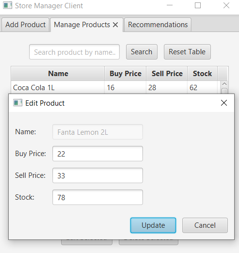

# 🛒 StoreManagerJavaApp

**StoreManagerJavaApp** is a Java-based client-server application that helps a small business owner manage inventory, view statistics, and receive smart product recommendations.

## 📦 Project Structure

- `server/` - Contains the business logic, algorithm implementations, and file-based database access.
- `client/` - A JavaFX-based user interface for interacting with the system.

## 🧠 Features

- 🔄 Add, update, delete, and search for products
- 📋 View a full list of products (including buy/sell prices and stock)
- 🧠 Smart recommendation algorithms:
    - Low stock recommendation
    - High profit recommendation
    - Adjustable result limits (e.g., top 5 or all)
- 🔔 Popup messages for success/failure feedback
- 🧪 Testable modular structure

## 📊 Technologies Used

- Java 17+
- JavaFX (GUI)
- File-based storage (no DB)
- Socket programming (ObjectInput/Output Streams)
- MVC design principles

## ▶️ How to Run

### Server

1. Open the `server/` module in IntelliJ
2. Run the class: `server.Server`

### Client

1. Open the `client/` module
2. Make sure JavaFX is configured:
    - Add `--module-path` and `--add-modules javafx.controls,javafx.fxml` in Run Configuration
3. Run the class: `client.ui.ClientApp`

> 💡 Note: Always start the **server first**, then the **client**.

## 📁 Data

All product data is stored in a text file at:
Every update is automatically saved and reloaded.

## 📷 Screenshots *

GUI screenshots here:

## 👨‍💻 Author

Nathan Illouz  
Computer Science Student | Junior Software Developer  